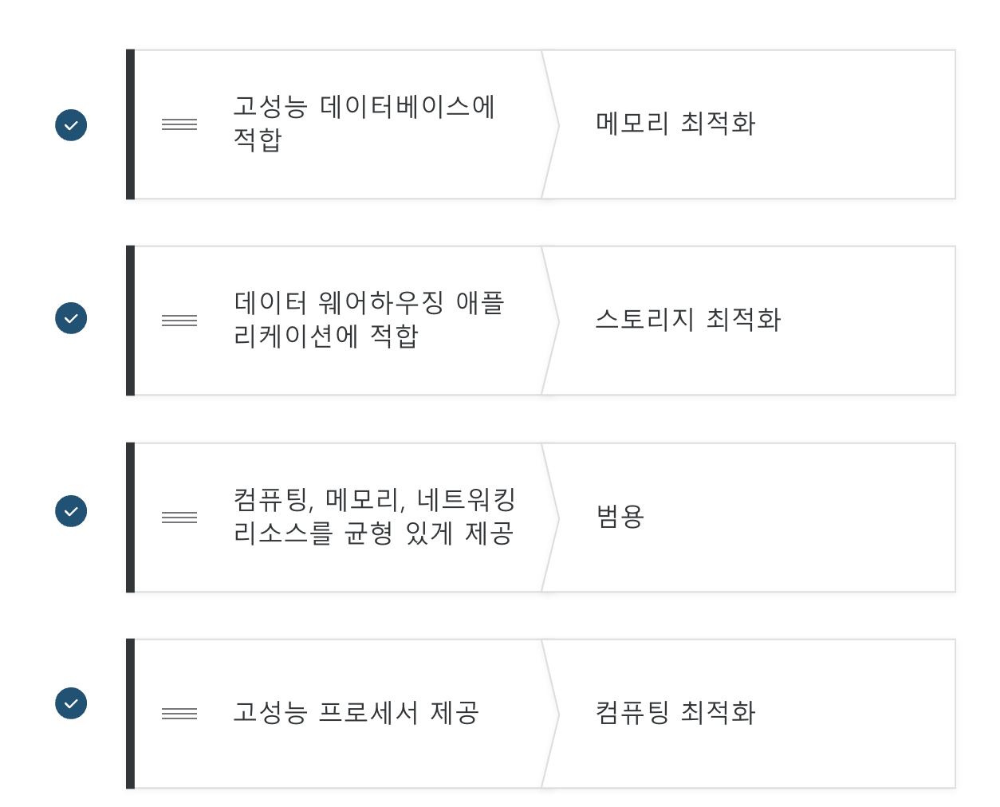

# AWS Practitioner

### 모듈-1

목표

- 클라우드 : 인터넷을 통해 IT 리소스를 온디맨드로 제공하는 서비스
- AWS의 이점을 요약할 수 있습니다.
  - 종량과금제 : 근무 시간에 대한 급여만 제공
  - On-premise(=프라이빗 클라우드) : 대규모 투자가 필요 + 운영 관리비 / 피크를 감당할 수 있게 설계하는 경우 운영의 상당 부분을 유휴 자원으로 두게됨(비효율성)
- 온디맨드식 제공과 클라우드 배포의 차이점을 설명할 수 있습니다.
  - 온디맨드 : 미리 통보하지 않더라도 사용자에게 필요한 리소스를 필요한 순간에 제공할 수 있는 방법(유연성)
  - 클라우드 배포의 종류는 클라우드 기반 배포, 온프레미스 배포, 하이브리드 배포가 있음.
    - 클라우드 배포는 모든 애플리케이션을 클라우드 기반으로 사용
    - 온프레미스는 레거시와 유사하지만 가상화 및 리소스 관리 도구를 사용한다.
    - 하이브리드는 두 개를 동시에 사용한다.
- 종량 과금제 모델을 요약 설명할 수 있습니다.
  - 온디맨드..

### 모듈-2

목표

- 기본적인 Amazon EC2의 이점을 설명할 수 있습니다.
  - Elastic Compute Cloud(EC2) = VM
  - 장점 : 유연성 / 빠름 /
  - 멀티 테넌시 : 가상컴퓨터 간 기본 하드웨어 공유(추가 이해 필요)
  - 하이퍼바이저 : 멀티 테넌시 수행 및 인스턴스 간 분리를 수행하는 주체
  - 프로비져닝 : CPU, Memory 등의 자원을 할당 또는 적절하게 배치하여 운영이 가능하도록 준비
- 서로 다른 Amazon EC2 인스턴스 유형을 파악할 수 있습니다.
  - 목적에 따라 다양한 유형의 EC2 인스턴스가 있음. 인스턴스 패밀리라고 함.
  - 범용, 컴퓨팅 최적화, 메모리 최적화, 엑설러레이티드(GPU인듯) 최적화, 스토리지 최적화(하둡과 같은 워크로드에 사용)
    
- Amazon EC2의 다양한 결제 옵션을 구분할 수 있습니다.
  - 온디맨드 : 시간당, 초당 결제
  - 세이빙스 플랜 : 리소스 사용량에 약정을 둬서 EC2 저렴하게 제공
  - 예약 인스턴스 : 사용량이 예측 가능할 경우(약정 방식 1년또는 3년) / 세이빙스 플랜과 차이를 모르곘다.
  - 스팟 인스턴스 : 유휴 자원을 싸게 빌려줌 대신 AWS가 리소스를 회수 할 수 있음(배치 워크로드에서 사용하면 좋다.)
  - 전용 호스트 : 다른 사용자와 물리적 호스트(서버)를 공유하지 않음
- Amazon EC2 Auto Scaling의 이점을 요약할 수 있습니다.
  - 동적 조정과 예측 조정
    - 동적 조정은 수요 변화에 대응 / 예측 조정은 수요에 따라 예측
  - 온프레미스에서 평균부하로 맞추는 경우 효율 but 최대 부하 해결 어려움
  - 온프레이스에서 최대부하로 맞추는 경우 효율성 감소
  - AWS는 이를 쉽게 해결!
  - 수직확장과 수평확장
    - 수직확장 : 성능을 향상시킨다.
    - 수평확장 : 인스턴스를 늘린다.
    
- Elastic Load Balancing의 이점을 요약할 수 있습니다.
  - 리젼 수준에서 자동으로 사용됨, EC2에서 컨트롤 하는 수준이 아닌 더 높은 수준임.
- Elastic Load Balancing 사용 사례를 제시할 수 있습니다.
  - 프론트엔드와 백엔드 연결에도 사용된다고 함.
  - 프론트엔드는 백엔드에 신경쓰지 않고 백엔드도 프론트엔드를 신경쓰지 않을 수 있으므로 분리된 방식이라 할 수 있다.
  
  -
- Amazon Simple Notification Service(Amazon SNS)와 Amazon Simple Queue Service(Amazon SQS)의 차이점을 요약할 수 있습니다.
  - 버퍼나 대기열을 도입하는 방식. 주문을 바로 백엔드에 전달하는게 아닌 주문보드 같은 곳에 적어놓는 방법을 버퍼 또는 대기열이라 한다.
  - 밀결합된 아키텍쳐(모놀리식) : 프론트와 백엔드가 직접 소통하는 경우 / 시스템 전체에 문제 발생 가능성 /앱 A ⇒ 앱 B
  - 소결합된 아키텍쳐(마이크로서비스) : 단일 장애가 연속 장애로 이어지지 않는 방법 / 앱 A ⇒ 메세지 대기열 ⇒ 앱 B
  - 메세징 = 대기열
  - 아마존 SQS : 메세지 전송, 저장, 수신 가능한 인프라
    
    계산원이 주문을 받고 바리스타가 음료를 만드는 주문 프로세스가 커피숍에 있다고 가정해 보겠습니다. 계산원과 바리스타가 애플리케이션의 두 가지 개별 구성 요소라고 생각하십시오.
    먼저 계산원이 주문을 받아 주문지에 적습니다. 그런 다음 계산원이 바리스타에게 주문지를 전달합니다. 마지막으로 바리스타가 음료를 만들어 고객에게 제공합니다.
    다음 주문을 받으면 프로세스가 반복됩니다. 이 프로세스는 계산원과 바리스타가 함께 조율되는 한 원활하게 진행됩니다.
    만약 계산원이 주문을 받아 바리스타에게 전달하려는데 바리스타가 쉬는 시간이거나 다른 주문으로 바쁘다면 어떻게 될까요? 계산원은 바리스타가 주문을 받을 준비가 될 때까지 기다려야 합니다. 그러면 주문 프로세스가 지연되고 고객은 주문한 음료를 받을 때까지 더 오래 기다려야 합니다.
    커피숍의 인기가 많아지고 주문하려는 고객의 줄이 줄어드는 속도가 더 느려지면 점주는 현재 주문 프로세스가 시간이 많이 걸리고 비효율적이라는 것을 알게 됩니다. 점주는 대기열을 사용하는 다른 접근 방식을 시도하기로 결정합니다.
    
    계산원과 바리스타가 애플리케이션의 두 가지 개별 구성 요소라는 점을 떠올리십시오. **Amazon SQS와 같은 메시지 대기열 서비스를 사용하면 분리된 애플리케이션 구성 요소 간에 메시지를 사용할 수 있습니다.**
    이 예에서 프로세스의 첫 번째 단계는 이전과 동일합니다. 즉, 고객이 계산원에게 주문합니다.
    계산원이 주문을 대기열에 넣습니다. 이를 계산원과 바리스타 사이의 버퍼 역할을 하는 주문판이라고 생각할 수 있습니다. **바리스타가 쉬는 시간이거나 다른 주문으로 바쁘더라도 계산원은 계속해서 새 주문을 대기열에 넣을 수 있습니다.**
    다음으로 바리스타가 대기열을 확인하고 주문을 검색합니다.
    바리스타가 음료를 만들어 고객에게 제공합니다.
    바리스타는 완료된 주문을 대기열에서 제거합니다.
    바리스타가 음료를 만드는 동안 계산원은 계속 새로운 주문을 받아 대기열에 추가할 수 있습니다.
  - 아마존 SNS : 메세지를 보내는 인프라, 게시 구독 서비스
    
    커피숍에 모든 비즈니스 영역의 업데이트를 포함하는 단일 뉴스레터가 있다고 가정해 보겠습니다. 여기에는 쿠폰, 커피 상식, 신제품과 같은 주제가 포함됩니다. 단일 뉴스레터이기 때문에 모든 주제가 그룹화됩니다. 뉴스레터를 구독하는 모든 고객은 쿠폰, 커피 상식, 신제품에 대한 업데이트를 받습니다.
    얼마 후 일부 고객이 관심 있는 특정 주제에 대해서만 별도의 뉴스레터를 받으면 좋겠다는 의견을 표명합니다. 커피숍 점주는 이 접근 방식을 시험해 보기로 결정합니다.
    
    이제 커피숍은 모든 주제를 다루는 단일 뉴스레터 대신 이를 3개의 뉴스레터로 나눴습니다. 각 뉴스레터는 쿠폰, 커피 상식, 신제품과 같은 특정 주제만을 다룹니다.
    이제 구독자는 구독한 특정 주제에 대해서만 즉시 업데이트를 받게 됩니다.
    구독자는 주제를 하나 또는 여러 개 구독할 수 있습니다. 예를 들어 첫 번째 고객은 쿠폰 주제만 구독하고 두 번째 구독자는 커피 상식 주제만 구독합니다. 세 번째 고객은 커피 상식 주제와 신제품 주제를 구독합니다.
- 그 외 AWS 컴퓨팅 옵션을 요약할 수 있습니다.
  - EC2 말고 다른 옵션
    서버리스 : 서버를 프로비저닝하거나 관리할 필요가 없다는 뜻
    모든 기본적인 환경 관리를 AWS가 처리해줌 사용자는 앱만 신경쓰면됨
    람다 = 서버리스(단기적인 실행 함수 호스팅, 코드만 올리면 끝난다!)
    트리거 ⇒ 람다함수로 구성됨. (15분 이상은 사용이 안되므로 딥러닝 같은 장기 프로세스에는 적합하지 않음)
    
    ECS(도커) / EKS(쿠버네티스) 컨테이너 오케이스트레이션 도구(플랫폼과 다름)
    FarGate : 컨테이너용 서버리스 컴퓨팅 엔진으로, Amazon ECS와 Amazon EKS에서 작동합니다.
    EC2(사용자가 OS에서 직접 컨테이너를 사용하고 싶을때)

### 모듈-3

- **AWS 글로벌 인프라의 이점을 요약할 수 있습니다.**
  - 리전과 리전간은 데이터가 공유되지 않음.(요구하지 않는 이상)
  - 리전 선택 조건
    - 규정준수 : 국가의 법을 지킨다.
    - 근접성 : 지연성을 고민하자
    - 기능 가용성 : 리전별로 원하는 기능이 없을 수 있다.
    - 요금 : 리전에 따라 요금 비용이 다를 수 있음.
- **가용 영역의 기본 개념을 설명할 수 있습니다.**
  - 가용 영역은 리전 내의 단일 데이터 센터 또는 데이터 센터 그룹입니다. 물리적으로 수십키로 떨어졌지만 논리적으로는 통일됨.
  - 하나의 리전에 가용영역(Availability Zone)을 분산배치하여 각종 재난 사항, 장애 사항에 대응하고자 함.
  - AWS는 한 리전에서 2개 이상의 가용영역을 추천한다고 함. 만약 리전 단위로 수행이 되는 서비스(ELB)같은 경우 가용영역을 알아서 골라준다고 함.
  
- **AWS CloudFront 및 엣지 로케이션의 이점을 설명할 수 있습니다.**
  - CDN(Contents Delivery, service) = Amazon Cloud Front
  - 짧은 지연시간으로 빠르게 콘텐츠를 전달해주는 서비스
  - 엣지 로케이션을 통해 사용자가 어떤 위치에 있든 빠르게 사용 가능(클라우드 프론트, Amz route 등 실행하는 서버)
  - AWS outpost : AWS 인프라 및 서비스를 온프레미스 데이터 센터로 확장합니다.
- **Amazon 서비스를 프로비저닝할 수 있는 다양한 방법을 비교할 수 있습니다.**
  - AWS 리소스 간 상호작용 방법 : API
  - 프로비저닝 방법
    - AWS Management console : 웹으로 프로비저닝
    - AWS CLI : 명렁어 라인으로 프로비저닝
    - AWS SDK : 프로그래밍 언어로 AWS 상호작용 가능
  - AWS Elastic Beanstalk
    - App 코드 + 구성을 넣으면 자동으로 환경을 구축해줌
      
  - AWS CloudFormation : 구축에 필요한 것들을 템플릿화 / 리소스를 정의하면 프로비저닝을 알아서 처리해줌

### 모듈-4

- **네트워킹의 기본 개념을 설명할 수 있습니다.**
  - Virtual Private Cloud(VPC) 내에 EC2, ELB 등을 배치하고 subnet을 통해 할당한다.
  - subnet은 VPC 내의 IP주소의 모음이다.
  - 네트워크 ACL(서브넷 단계) : 기본 네트워크 액세스 제어 목록 / 여권 심사대 처럼 서브넷에 출입하는 패킷을 검사함. 발신자가 승인목록에 있는지 검토함 .
    > 아무것도 기억하지 않고 각 방향(인바운드 및 아웃바운드)으로 서브넷 경계를 통과하는 패킷만 확인한다.
    
  - 보안 그룹(인스턴스 단계) : 기본적으로 어떤 트래픽도 인스턴스로 이동 못하게 설정, 그리고 모든 인스턴트는 보안 그룹 내에서 시작함.(건물의 문지기 역할) / 트래픽 진입을 점검 but 모든 트래픽이 나갈 수 있음.
    > **보안 그룹은 상태 저장이며 기본적으로 모든 인바운드 트래픽을 거부한다.**
    
  - 네트워크 ACL과 보안그룹 차이 : 보안그룹은 상태 저장 ACL은 상태 미저장 / 패킷이 들어갔는지 나갔는지 기록하지 않는다는 말.
  - 보안 그룹은 아래와 같이 경비원 역할을 수행하며 패킷이 이전에 방문했는지를 알 수 있음(상태저장)
    
  -
- **퍼블릭 네트워킹 리소스와 프라이빗 네트워킹 리소스의 차이점을 설명할 수 있습니다.**
  - 퍼블릭 서브넷 - 인터넷과 직접 대화(카운터 직원) / 인터넷 게이트웨이를 통해 접근한다.
    
    > **퍼블릭 서브넷**
    > 에는 온라인 상점의 웹 사이트와 같이 누구나 액세스할 수 있어야 하는 리소스가 포함됩니다.
  - 프라이빗 서브넷 - 카운터 직원과 소통(바리스타)
    특정 트래픽만 받아들이는 방식(인터넷 사용자와 대역폭을 공유함)/ 온프레미스를 구축할 때 사용함.
    
    > **프라이빗 서브넷**에는 고객의 개인 정보 및 주문 내역이 포함된 데이터베이스와 같이 프라이빗 네트워크를 통해서만 액세스할 수 있는 리소스가 포함됩니다.
- **실제 시나리오를 사용하여 가상 프라이빗 게이트웨이를 설명할 수 있습니다.**
-
- **실제 시나리오를 사용하여 Virtual Private Network(VPN)를 설명할 수 있습니다.**
  -
- **AWS Direct Connect의 이점을 설명할 수 있습니다.**
  - AWS Direct Connect - 전용 광섬유 연결을 구축
    > **[AWS Direct Connect](https://aws.amazon.com/directconnect/)**는 데이터 센터와 VPC 간에 비공개 전용 연결을 설정하는 서비스입니다.
  
  
- **하이브리드 배포의 이점을 설명할 수 있습니다.**
- **IT 전략에서 사용되는 보안 계층을 설명할 수 있습니다.**
  - NACL(Network Access Client List)
  - Security Group
- **고객이 AWS 글로벌 네트워크와 상호 작용하기 위해 사용하는 서비스를 설명할 수 있습니다.**
  - Route 53 : AWS의 DNS임. 라우팅을 돕는 서비스
    > 이 서비스는 개발자와 비즈니스가 최종 사용자를 AWS에서 호스팅되는 인터넷 애플리케이션으로 라우팅할 수 있는 안정적인 방법을 제공합니다.
  - Amazon CloudFront: AWS의 CDN임. 엣지로케이션에서 실행됨.
  ***

### 모듈-5

- EC2에는 기본적으로 인스턴스 스토리지 볼륨이 있다. 이때 인스턴스 스토리지는 AWS 호스트에 물리적으로 연결되어있으며, AWS가 종료되면 파일이 사라지므로 파일을 잃어도 상관없는 경우에 사용하도록 한다.
  
- **스토리지 및 데이터베이스의 기본 개념을 요약할 수 있습니다.**
  - 블록 스토리지와 객체 스토리지를 잘 모르겠다..
  - 객체 스토리지
    각 객체는 데이터, 메타데이터, 키로 구성됩니다.
    
  - 블록 스토리지
    파일을 여러 블록으로 나눠서 저장함. 복잡한 읽기 쓰기인 경우 블록
  - **파일 스토리지**
    여러 클라이언트(예: 사용자, 애플리케이션, 서버 등)가 공유 파일 폴더에 저장된 데이터에 액세스할 수 있습니다.
- **Amazon Elastic Block Store(Amazon EBS)의 이점을 설명할 수 있습니다.**
  - 일시적이지 않은 로컬스토리지 확보 목적
  - 인스턴스 스토리지 볼륨과 다르게 AWS 호스트와 물리적으로 연결되어있지 않음.
  - 대신 EBS는 EC2와 동일한 가용 영역에 존재해야함.
  
  - **[EBS 스냅샷](https://docs.aws.amazon.com/AWSEC2/latest/UserGuide/EBSSnapshots.html)**은 증분 백업입니다. 즉, 처음 볼륨을 백업하면 모든 데이터가 복사됩니다. 이후의 백업에서는 가장 최근의 스냅샷 이후 변경된 데이터 블록만 저장됩니다.
    
- **Amazon Simple Storage Solution(Amazon S3)의 이점을 설명할 수 있습니다.**
  - 객체를 버킷에 저장한다. 디렉토리 = 버켓
  - 최대 5TB, 객체 버전관리 가능
  - S3 standard : 99.999999999% 내구성을 재공한다고 한다. (9가 11번이라 나인 일레븐이라고 부름) 파일 잃을 가능성 없다.
  - S3 Standard는 데이터가 3개 이상의 가용 영역에 저장됨. 시설 안에서도 2개 이상의 물리장치에 저장됨
  - S3 정적 웹 사이트 호스팅 : 독자적으로 웹사이트 호스팅 기능이 있음.
  - S3 Standard-IA(Infrequent Access): 엑세스 빈도는 낮지만 필요할 때 빠르게 불러와야하는 경우(재난 복구 용도)
  - S3 Glaicer : 데이터를 오래 저장해야하는 경우
  - S3 수명주기 : 생성후 한달 동안 S3 standard ⇒ 그 이후로는 S3 IA ⇒ 또 그 이후로는 S3 Glacier로 이동시킴.
- **EBS와 S3 비교**
  - EBS
    
  - S3
    - 웹 지원
    - 리전별 분산(내구성이 좋은 이유)
    - 비용절감효과
    - 서버리스
    
- **Amazon Elastic File System(Amazon EFS)의 이점을 설명할 수 있습니다.**
  - 여러 인스턴스가 공유할 수 있는 폴더임
  - 리눅스 파일 시스템임
  - 리전 리소스임
  - 자동확장 가능
  - EBS는 단일 가용영역에서 사용하지만 EFS는 리전에서 사용한다.
- **다양한 스토리지 솔루션을 요약할 수 있습니다.**
- **Amazon Relational Database Service(RDS)의 이점을 설명할 수 있습니다.**
  - AWS 클라우드에서 관계형 데이터베이스를 실행할 수 있는 서비스를 말한다.
  - **관계형 데이터베이스**에서는 데이터가 다른 데이터 부분과 관련된 방식으로 저장된다.
  - 리프트 앤 시프트 마이그레이션 : 데이터 센터에 있는 데이터베이스를 EC2와 같은 클라우드에 활용 가능
  - Amazon Aurora(데이터베이스 엔진 중 하나)
    - Mysql과 postgresql을 지원함.
    - 3개의 시설에서 각 2개의 물리적으로 복제됨
    - S3로의 지속적 백업을 지원
    - 특정 시점으로 복구 가능
- **Amazon DynamoDB의 이점을 설명할 수 있습니다.**
  DynamoDB는 **서버리스 키-값 데이터베이스 서비스를 말함.**
  
  - Nosql은 행과 열이 아닌 구조를 사용하여 데이터를 구성하기 때문에 ‘NoSQL 데이터베이스’라고도 합니다.
  - Nosql의 구조적 접근 방식 중 한 유형은 **키-값 페어**입니다. 키-값 페어에서는 데이터가 항목(키)으로 구성되고 항목은 속성(값)을 갖습니다.
  - 특수 목적으로 설계해야함. 모든 경우에는 사용할 수 있는건 아님.
  - 고정적인 Schema와 테이블과 간계를 표현하는 RDBMS와 다르게 유연성을 갖고 있음.
  - 항목과 속성으로 구성된다고 함.
  - 사용자를 대신해 스토리지를 관리함.
  - 데이터를 가용영역에 중복적으로 저장함.
- **다양한 데이터베이스 서비스를 요약할 수 있습니다.**
  - AWS RDS
    
  - DynamoDB
    
- RedShift
  **[Amazon Redshift](https://aws.amazon.com/redshift)**는 빅 데이터 분석에 사용할 수 있는 데이터 웨어하우징 서비스입니다. 이 서비스는 여러 원본에서 데이터를 수집하여 데이터 간의 관계 및 추세를 파악하는 데 도움이 되는 기능을 제공합니다.
- **AWS Database Migration Service(AWS DMS)**
  - 관계형 데이터베이스, 비관계형 데이터베이스 및 기타 유형의 데이터 저장소를 마이그레이션할 수 있는 서비스
  - 마이그레이션 중에도 DB 사용가능

### 모듈-6
