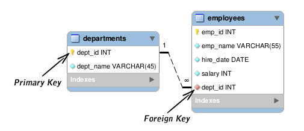

# 용어 및 문법

## Foreign Key, Primary Key

---



그림 1-1 Primary Key와 Foreign Key

### 두 종류의 Key를 사용하는 이유

- 중복된 데이터 저장을 막기 위함
- 메인 Table을 하나 두고 다른 분야의 상세정보를 연결할 때 Foreign Key를 사용하면 깔끔함.
- 그림 1-1에서 보듯 employees Table은 dept_id를 통해서 departments 내용을 불러 올 수 있다.

### Join을 위해서 굳이 Primary, Foreign Key를 설정할 필요 없다. 데이터 중복을 막기 위함일 뿐

## DB, Table 관련 문법

- SHOW DATABASES;
- USE [DATABASE NAME] ;
- SHOW TABLES; ⇒ 테이블 이름 보여줌
- SHOW COLUMNS FROM [TABLE NAME]; = DESC [TABLE NAME]
- SHOW TABLE STATUS ⇒ 테이블들 정보 보여줌

### 외부 변수를 활용해 원하는 쿼리 작성 방법

- WHERE을 사용할 때 Value가 String일 경우 따옴표를 붙여줘야 정상작동한다.

```python
cursor.execute('SELECT * FROM backend_dodomoalibinfo WHERE 지역 = **"영등포"**')
```

### FIND_IN_SET(column명, 변수) > 0

- **대신 변수 = 'a,b,c' 형태여야함.**

```python
var = "영등포,동작,양천"
query = f'SELECT * FROM backend_dodomoalibinfo WHERE FIND_IN_SET(지역,"{var}") > 0'
cursor.execute(query)

```

- **부등호를 붙이는 이유**
  ```python
  FIND_IN_SET = 0 : set에 들어있지 않은 값 보여줌
  FIND_IN_SET = 1 : 첫번째 조건과 일치한 변수를 보여줌
  FIND_IN_SET = 2 : 두번째 조건과 일치한 변수를 보여줌
  FIND_IN_SET = 3 : 세번째 조건과 일치한 변수를 보여줌

  ∴ FIND_IN_SET > 0 : 1,2,3 조건 모두 들어있는 변수를 보여줌

  ```

### Where 순서와 Join 속도 이해하기

1. Join을 한 다음 Where로 필터링한 경우( 합친다음 필터링)

   ```python
   SELECT book.*, lib.지역 FROM backend_dodomoabookinfo AS book
                      LEFT JOIN backend_dodomoalibinfo AS lib
                      ON book.ISBN = lib.ISBN
                      **where FIND_IN_SET(지역,"{var}") > 0**

   18 ms ± 538 µs per loop (mean ± std. dev. of 7 runs, 10 loops each)
   ```

1. Where 없이 On만 사용하기 (where과 On 차이가 뭔지 모르지만 On으로 쓰면 2배 느려짐, 왜저러는거지)

   ```python
   SELECT book.*, lib.지역 FROM backend_dodomoabookinfo AS book
                      LEFT JOIN backend_dodomoalibinfo AS lib
                      ON book.ISBN = lib.ISBN
                      **AND FIND_IN_SET(지역,"{var}") > 0**

   54.1 ms ± 391 µs per loop (mean ± std. dev. of 7 runs, 10 loops each)
   ```

1. Where로 먼저 필요한 index만 찾은 다음 Join해서 내보내기(필터링 한 다음 합침)

   ```python
   SELECT book.*, lib.지역 FROM **(SELECT * FROM backend_dodomoalibinfo where FIND_IN_SET(지역,"{var}") > 0)** AS lib
                      LEFT JOIN  backend_dodomoabookinfo AS book
                      ON book.ISBN = lib.ISBN

   15 ms ± 331 µs per loop (mean ± std. dev. of 7 runs, 100 loops each)
   ```

## Explain 내용 해석 관련

[https://nomadlee.com/mysql-explain-sql/](https://nomadlee.com/mysql-explain-sql/)

## 하나의 열에서 여러 단어 검색하기 (FULL TEXT) — 결론 실패

### ⇒ 그냥 최대한 row를 적게 산출할 수 있도록해서 파이썬으로 문제를 해결하는게 훨씬 이익이 될듯

### Full Text 설정하기

[https://cholol.tistory.com/483](https://cholol.tistory.com/483)

```sql
cursor.execute(f'''CREATE FULLTEXT INDEX `keyword2` on backend_dodomoakeyword2(`keyword`)''')
result = cursor.fetchall()
pd.DataFrame(result)
```

### Full Text 설정여부 확인하기

```sql
cursor.execute(f'''SELECT TABLE_SCHEMA, TABLE_NAME
FROM information_schema.statistics
WHERE index_type LIKE 'FULLTEXT%' ''')
result = cursor.fetchall()
pd.DataFrame(result)
```

### 토크나이저 크기 확인하기

```sql
cursor.execute(f''' show variables like "%ft_min%"''')
result = cursor.fetchall()
pd.DataFrame(result)
```

### 키워드 겹치는 개수 계산하기(REGEXP와 CHAR_LENGTH 활용)

**원리 : (전체 키워드 문장 길이 - 키워드에서 검색 키워드 뺀 문장 길이) / (문장 길이 -(검색 키워드 개수 -1)) ⇒ Max 1 ~ min 0**

**즉 값이 0인 건 매칭이 안되는 책이라는 것임**

용어설명

- REGEXP_REPLACE ⇒ 중복되는 단어 제거
- Char_LENGTH ⇒ 단어 개수
- 마지막에 (검색 키워드 개수 -1) 을 하는 이유 ⇒ 띄어쓰기 때문임

**연습용 SQL(나중에 까먹을까봐 저장해놓음)**

```sql
## 연습용
cursor.execute(f''' SELECT
ROUND ((CHAR_LENGTH(`keyword`) - CHAR_LENGTH(REGEXP_REPLACE(`keyword`, '도커 쿠버네티스', ''))) / CHAR_LENGTH('도커 쿠버네티스')) AS appearance,
(CHAR_LENGTH(`keyword`) - CHAR_LENGTH(REGEXP_REPLACE(`keyword`, '도커|쿠버네티스', ''))) / (CHAR_LENGTH('도커 쿠버네티스') -1) AS appearance2,
CHAR_LENGTH(`keyword`) - CHAR_LENGTH(REGEXP_REPLACE(`keyword`, '도커|쿠버네티스', '')) as num_regex,
CHAR_LENGTH(`keyword`) - CHAR_LENGTH(REPLACE(`keyword`, '도커 쿠버네티스', '')) as num,
CHAR_LENGTH(`keyword`) as len,
CHAR_LENGTH(REGEXP_REPLACE(`keyword`, '도커|쿠버네티스', '')) as rep,
CHAR_LENGTH('도커 쿠버네티스') -1 as num2
FROM backend_dodomoakeyword2
WHERE match(keyword) against("도커 쿠버네티스")''')

result = cursor.fetchall()
k = pd.DataFrame(result)
# print(k.appearance.unique())
k
|   | appearance | appearance2 | num_regex | num | len | rep | num2 |
|--:|-----------:|------------:|----------:|----:|----:|----:|-----:|
| 0 |          0 |      1.0000 |         7 |   0 | 189 | 182 |    7 |
| 1 |          1 |      1.0000 |         7 |   8 | 161 | 154 |    7 |
| 2 |          0 |      1.0000 |         7 |   0 | 181 | 174 |    7 |
| 3 |          0 |      1.0000 |         7 |   0 | 179 | 172 |    7 |
| 4 |          0 |      1.0000 |         7 |   0 | 192 | 185 |    7 |
```
