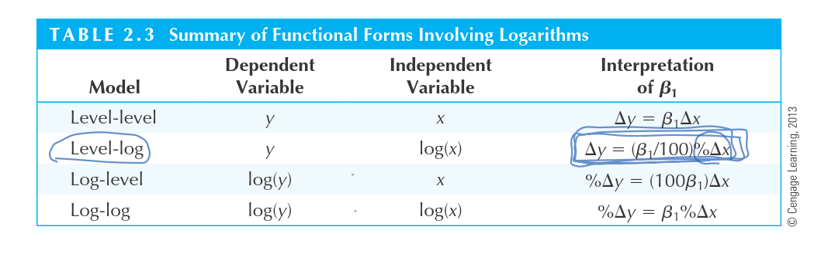
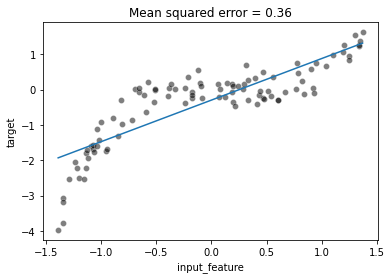

# 질문 모음

## 통계학에서 로그함수를 사용하는 이유

- **로그는 태생이 큰 값을 작게 표기하기 위해 고안된 방법이다.**
  루트,제곱,로그는 같은 개념 다른 표현

- **등비수열을 등차수열로 ⇒ 곱셈을 덧셈으로 , 나눗셈을 뺄셈으로 단순화 시킬 수 있다!!!**
  1 , 2 , 3 , 4 , 5 , 6
  2 , 4, 8 , 16 ,32 ,64

- **증가와 감소의 비율을 똑같게 만든다.**

  - 100%증가(2배 증가) ⇒ x + x = log2logx
    50%감소(1/2배 감소) ⇒ x - 0.5x = -log2logx

    400%증가(5배 증가) ⇒ x + 4x = log5logx
    80%감소(1/5배 감소) ⇒ x - 0.8x ⇒ -log5logx

- **x(explanatory variable)의 변화량에 따라 y(response variable)의 변화량을 알 수 있음**

  log를 씌운 값에 대해서 어떻게 해석하는지는 차차 알아가자. 일단 외우는걸 우선해야겠다.

  

  - Level-log 예시
    Change = $\frac{b-a}{a}$ = 순간변화량($\frac{\Delta x}{x}$)
    ex) $x_0 = 100, \;x_1=101$일때 증가량은 $\frac{101-100}{100} = 0.01$
    $y = log_{e}x$에서 $log_e101 - log_e100 => log_e1.01 => 0.01$
    $\therefore 100*\Delta log(x) \;\approx \; \%\Delta x$ (변화가 10%미만에서 써야 오류가 적다고 한다.)

- **지수함수와 같이 기하급수적으로 증가하는그래프에 log를 씌우면 직선이 된다.**

  암튼 결론은 기하급수적 증가와 같은 제곱형식의 그래프에 로그를 씌어주면 직선이 된다는 것이다!

  대신 x에 대한 해석을 잘해야겠지.

  $y= X =log_2\;2^x$ x가 10일때 2^10 증가한다라고 봐야하는건가.

  

## **Polynomial Features**

degree =2는 $(X_1, X_2)$ ⇒ $(1, X_1, X_2, X_1^2, X_1X_2, X_2^2)$ 이렇게 확장시킴

### 사용 목적

Polynomial Regression을 만들기 위해서 polynomial feature를 사용함. Polynomial regression은 활용하는 데이터가 Linear Regression으로는 정확히 예측하기 어려울 때(underfit 될때) 사용한다.

Polynomial regression is a form of Linear regression where only due to the Non-linear relationship between dependent and independent variables we add some polynomial terms to linear regression to convert it into Polynomial regression.
Polynomial Regression is a form of Linear regression known as a special case of Multiple linear regression which estimates the relationship as an nth degree polynomial. Polynomial Regression is sensitive to outliers so the presence of one or two outliers can also badly affect the performance.

$y = a_0 + a_1x_1 + a_2x_1^{2} + … + a_nx_1^n$ —— Polynomial regression

## **Polynomial regession이 linear regression인 이유**

우리는 x와 y 값을 알고 있고 coef는 1차 식이다. 따라서 polynomial regression도 linear model이 된다. 어차피 linear regression은 coefficient를 찾는 과정이지 않는가.

실제로도 linear model이라고 함. $\hat{p}=\hat{β}+\hat{β}_1xi+\hat{β}_2x^2_i$을 3차원 그래프로 그려보면 이렇게 linear model(2d plane)으로 나온다고 함.

출처 :
[Why is polynomial regression considered a special case of multiple linear regression?](https://stats.stackexchange.com/questions/92065/why-is-polynomial-regression-considered-a-special-case-of-multiple-linear-regres)
[Polynomial Regression | What is Polynomial Regression](https://www.analyticsvidhya.com/blog/2021/07/all-you-need-to-know-about-polynomial-regression/#h2_1)

## Ridge regression

### Bias- variance tradeoff

- **Error(X) = noise(X) + bias(X) + variance(X)**

## hypothesis test는 correlation을 찾을때도 활용되나?

ㅇㅇ 두 변수 사이의 independent를 측정하는 방법이 있음. categorical에서 chi-square가 그러함.

numerical value는 scatter plot만 보더라도 관계를 금방 알 수 있음.

## nested_cross_validation와 Inner_cross_validation 차이점

inner는 hyperparameter를 찾는데 사용되는 cross-validation이고 nested_cross_validation은 모델의 성능을 테스트하는데 사용되는 cross-validation인듯

Nested_cross validation은 cv를 두 번 사용하는 방법의 명칭이고 inner_cv와 outer_cv는 해당 cv에서 각각 불리는 명칭이다. inner_cv는 best hyperparameter를 찾는데 활용되고 이렇게 찾은 hyperparameter를 바탕으로 모델의 generalization을 산출하기 위해 outer_cv를 사용한다.

## Bootstrap과 boosting 차이는?

- **boosting : 예측에 실패한 value를 가지고 재학습하는 방법론을 통칭한다. Adaboost와 GBDT가 있다.**
  - Adaptive boost
    틀린 문제를 다시 푸는 방식, regressor, classifier 모두 적용가능
  - GBDT
    Decision Tree에만 해당됨. 이전 학습에서 틀린 문제를 바탕으로 다시 예측하는 모델을 만듬. 틀린 문제를 가지고 다시 모델을 만들어서 예측함. 수많은 decision tree를 생성함
    GBDT will fit a decision tree on the residuals error (hence the name “gradient”) of the previous tree. Therefore, each new tree in the ensemble predicts the error made by the previous learner instead of predicting the target directly.
- ## **bootsrap : 샘플을 중복되게 추출해서 여러 표본을 만드는 방법임 sklearn course에서는 bagging만 설명하고 있다.**

## Downstream model이 뭐지?

In a more general setting, I can only guess: y is downstream of x if and only if y uses data processed by x. Y는 X의 downstream이다.는 말은 X로 돌린 결과를 Y가 사용한다는 의미임. Y= 3x, x= 8k k를8배 한 값인 x를 Y가 사용한다.

## Logistic Regression에서 사용되는 iter는 뭐지?

max_iter는 Gradient Descent 방식을 반복해서 몇번 수행할 것인가를 설정하는 것임. 수렴(Convergence)하게 되면 횟수를 늘려도 성능이 거의 달라지지 않습니다. 따라서 500, 1000, 2000을 넣어도 일단 수렴이 된 후에 반복은 성능에 영향을 주지 않는다.

## Disjoint와 independent 차이는?

- Disjoint는 사건 A와 B가 동시에 발생할 수 없는 경우를 말한다. ex) 동전이 앞면이면서 뒷면일 수 없다. 한 명에게 주는 상을 두 명이 받을 수 없다.
- Indepedent는 A와 B 발생에는 아무런 상관 관계가 없음을 말한다. ex) 까마귀 날자 배 떨어진다. 배가 떨어진것과 까마귀가 나는 것은 동시에 일어난 행동이지만 상호 간 영향을 주고 받고에 의해 결정된 결과가 아니다.

## Linear 모델에서 Regularization이 무엇을 의미하는거지?

**Overfiting을 막기위한 방법이라고 생각하자.** 이 방법은 모델에 제약(penalty)을 주는 것 입니다. 쉽게 말하자면, *perfect fit 을 포기함으로써(trainging accuracy를 낮춤으로써)  potential fit을 증가시키고자(testing accuracy를 높이고자) 하는 것* 입니다.

## ratio와 Change

### ratio는 배수로 증가하고 change는 퍼센티지로 증가한다.

2배 증가한다는 말은 1:1 ⇒ 2:1 ⇒ 100%증가는 $\frac{b-a}{a}= 1$ ⇒ b= a+a

4배 증가한다는 말은 1:1 ⇒ 4:1 ⇒ 300%증가는 $\frac{b-a}{a}= 3$ ⇒ b =a+3a

5배 증가한다는 말은 1:1 ⇒ 5:1 ⇒ 400% 증가한다고 할 수 있다.

5:3일때 1.75배 증가한다는 말은 ⇒ 5/3\*1.75:1 ⇒

2.917:1⇒ 191.7% 증가를 의미한다. / b=8.75 a =3

수익이 80%감소했어 ⇒ a-0.8a = b ⇒ b:a = 1:5야 1/5배와 같아.

b-a =-0.8a ⇒ b =0.2a ⇒ 1:5 1/5배 됐어 라는 말과 같네.

### ratio와 change가 헷갈리는 이유

ratio와 change가 헷갈리는 이유는 우리가 증가를 얘기할 땐 ratio를 감소를 얘기할 때 change를 쓰기 때문이다. 1000만원을 투자해 2000만원을 벌면 우리는 2배 벌었어라고 말하지 100%벌었어 라고 말하지 않는다. 반대로 1000만원을 투자해 500만원이 됐을때 반토막 났어 또는 50%손실이야 라고 말하지 1/2배 손실이야 라고 말하지 않는다.

우리가 이렇게 일상에서 자주사용하는 개념이다 보니 머리속에 예시로 들만한게 많고 그러면서 개념이 헷갈리게 된다.

이제는 몇배라는 애기를 할때 ratio를 쓰고 몇퍼센트라고 얘기할 땐 change라는 사실을 유의하자.

1000만원에서 3000만원을 벌었다면 투자금의 3배를 번 것이고 200%의 수익이 발생했다고 말해야한다.

반면 1000만원이 300만원이 됐다면 투자금의 0.3배를 번 것이고 -70%의 손실이 발생했다고 말해야한다.

2500만원으로 4800만원을 벌었을 경우 ⇒ 25:48 ⇒ 23/25 ⇒ 92% 수익률 ⇒ 1.92배 벌었다.

2500만원이 430만원으로 감소 ⇒ 250:43 ⇒ =82.8% 손실이 발생 ⇒.0172배
